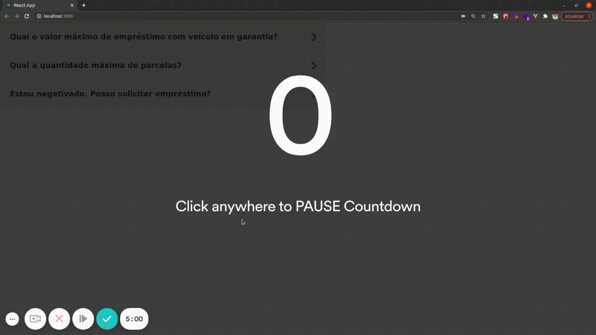

<div align=center>

 
<h3>

Menu acoordion com **ReactJS**.

</h3>



</div>

<br>
<br>

### 📌  **Tecnologias utilizadas**
- [ReactJS]

<br>

### 🚀 **Mão na massa**

```bash
# Clone este repositório
$ git clone https://github.com/Joao-Augusto-Oliveira/accordion

# Acesse a pasta do projeto no terminal/cmd
$ cd accordion

# Instale as dependências
$ yarn

# Execute a aplicação em modo de desenvolvimento
$ yarn start

```

<br>

<h3 align="center">
Feito com 💜 por <a href="https://www.linkedin.com/in/joão-augusto-oliveira-dos-santos-9b0693195">João Augusto</a>
 
</h3>

<!-- Links -->
[ReactJS]: https://reactjs.org
